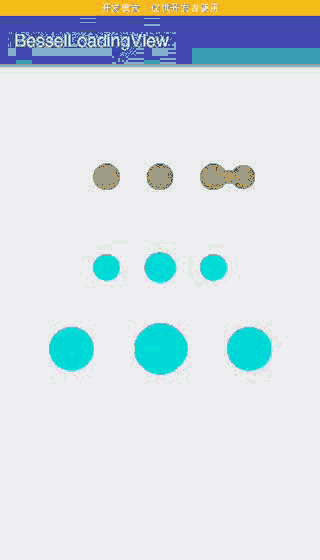

# BesselLoadingView

[BesselLoadingView](https://github.com/Jerey-Jobs/BesselLoadingView)是一个贝塞尔曲线效果的加载过渡动画。使用canvas绘制的自定义view。

-------------------
### 效果


### 引入

project's build.gradle (工程下的 build.gradle)
``` gradle
  allprojects {
    repositories {
      ...
      maven { url 'https://jitpack.io' }
    }
  }
```

module's build.gradle (模块的build.gradle)
``` gradle
  dependencies {
          compile 'com.github.Jerey-Jobs:BesselLoadingView:1.1'
  }
```

## Usage/用法

上图效果的layout是这样的.

``` xml
<?xml version="1.0" encoding="utf-8"?>
<android.support.constraint.ConstraintLayout
    xmlns:android="http://schemas.android.com/apk/res/android"
    xmlns:app="http://schemas.android.com/apk/res-auto"
    xmlns:tools="http://schemas.android.com/tools"
    android:layout_width="match_parent"
    android:layout_height="match_parent"
    tools:context="com.jerey.besselloadingview.MainActivity">

    <com.jerey.besselloadingviewlib.BesselLoadingView
        android:layout_width="wrap_content"
        android:layout_height="wrap_content"
        app:loadingduration="4000"
        app:loadingcolor="#555555"
        app:layout_constraintBottom_toBottomOf="parent"
        app:layout_constraintLeft_toLeftOf="parent"
        app:layout_constraintRight_toRightOf="parent"
        app:layout_constraintTop_toTopOf="parent"
        app:layout_constraintVertical_bias="0.2"/>

    <com.jerey.besselloadingviewlib.BesselLoadingView
        android:layout_width="wrap_content"
        android:layout_height="wrap_content"
        app:layout_constraintBottom_toBottomOf="parent"
        app:layout_constraintLeft_toLeftOf="parent"
        app:layout_constraintRight_toRightOf="parent"
        app:layout_constraintTop_toTopOf="parent"
        app:layout_constraintVertical_bias="0.4"/>

    <com.jerey.besselloadingviewlib.BesselLoadingView
        android:layout_width="400dp"
        android:layout_height="150dp"
        app:layout_constraintBottom_toBottomOf="parent"
        app:layout_constraintLeft_toLeftOf="parent"
        app:layout_constraintRight_toRightOf="parent"
        app:layout_constraintTop_toTopOf="parent"
        app:layout_constraintVertical_bias="0.6"/>

</android.support.constraint.ConstraintLayout>

```


### 编写过程

首先我们提供三个可配置选项,分别是颜色,动画周期时长,圆的半径(半径同时会根据设置的大小变化)

``` xml
<declare-styleable name="BesselLoadingView">
    <attr name="loadingradius" format="dimension"></attr>
    <attr name="loadingcolor" format="color"></attr>
    <attr name="loadingduration" format="integer"></attr>
</declare-styleable>
```

与一般自定义View一样,我们在构造方法中获取自定义的几个属性,

``` java
public BesselLoadingView(Context context, AttributeSet attrs, int defStyleAttr) {
    super(context, attrs, defStyleAttr);
    initUI(context, attrs);
}

private void initUI(Context context, AttributeSet attrs) {
    mPaint = new Paint();
    //路径
    mPath = new Path();
    mCirclesX = new int[3];
    TypedArray ta = context.obtainStyledAttributes(attrs, R.styleable.BesselLoadingView);
    mLoadingColor = ta.getColor(R.styleable.BesselLoadingView_loadingcolor, DEFAULT_COLOR);
    mRadius = ta.getDimension(R.styleable.BesselLoadingView_loadingradius, DEFAULT_RADIUS);
    mDuration = ta.getInt(R.styleable.BesselLoadingView_loadingduration, DEFAULT_DURATION);

    mPaint.setColor(mLoadingColor);
    mPaint.setAntiAlias(true); //抗锯齿

    mRadiusFloat = mRadius * 0.9f;

}
```

### onMeasure

构造方法里面我们只初始化了一些必要的配置参数, 但是我们的圆与圆之间的距离啊什么的还没初始化,我们在onMeasure中进行初始化一些大小的参数

我做了比如配置的半径比实际的上下高度还要大的情况下自动缩小啊,等一系列自适应操作.并且默认为
```
    android:layout_width="wrap_content"
    android:layout_height="wrap_content"
```

时,默认大小为480像素宽,100像素高

``` java
@Override
protected void onMeasure(int widthMeasureSpec, int heightMeasureSpec) {
    super.onMeasure(widthMeasureSpec, heightMeasureSpec);
    int mWidth;
    int mHeight;

    int widthMode = MeasureSpec.getMode(widthMeasureSpec);
    int widthSize = MeasureSpec.getSize(widthMeasureSpec);
    int heightMode = MeasureSpec.getMode(heightMeasureSpec);
    int heightSize = MeasureSpec.getSize(heightMeasureSpec);

    if (widthMode == MeasureSpec.EXACTLY) {
        mWidth = widthSize;
    } else {
        mWidth = getPaddingLeft() + 480 + getPaddingRight();
    }

    if (heightMode == MeasureSpec.EXACTLY) {
        mHeight = heightSize;
    } else {
        mHeight = getPaddingTop() + 100 + getPaddingBottom();
    }

    setMeasuredDimension(mWidth, mHeight);
    log("width: " + mWidth + " h: " + mHeight);
    //计算x方向三个圆心   -.-.-.-
    int lenth = mWidth / 4;
    for (int i = 0; i < 3; i++) {
        mCirclesX[i] = lenth * (i + 1);
    }

    //计算三个圆心Y坐标
    mCirClesY = mHeight / 2;
    //三个初始圆的半径
    mRadius = mHeight / 3;
    mRadiusFloat = mRadius * 0.9f;
    log("mCirclesX: " + mCirclesX[0] + "," + mCirclesX[1] + "," + mCirclesX[2] + "  Y: " + mCirClesY);

    if (mRadius >= lenth / 4) {
        log("圆的半径大于间隙了,自动缩小");
        mRadius = lenth / 4;
        mRadiusFloat = mRadius * 0.9f;
    }

    mMinDistance = lenth;

    log("mMinDistance " + mMinDistance);

    ValueAnimator valueAnimator = ValueAnimator.ofFloat(mRadius, mWidth - mRadius);
    valueAnimator.setInterpolator(new LinearInterpolator());
    valueAnimator.setDuration(mDuration);
    valueAnimator.setRepeatMode(ValueAnimator.REVERSE);
    valueAnimator.setRepeatCount(ValueAnimator.INFINITE);
    valueAnimator.addUpdateListener(new ValueAnimator.AnimatorUpdateListener() {
        @Override
        public void onAnimationUpdate(ValueAnimator animation) {
            mFloatX = (float) animation.getAnimatedValue();
            postInvalidate();
        }
    });
    valueAnimator.start();
}
```

### onDraw

接下来重点来了, 我们需要画几个东西, 三个固定圆, 一个浮动圆, 贝塞尔曲线, 固定圆半径变化.

在绘制贝塞尔曲线的时候,需要先计算浮动圆离哪个固定圆最近,然后绘制相聚最近的圆的贝塞尔曲线,再计算距离,计算出圆应该变化多大.

``` java
    @Override
    protected void onDraw(Canvas canvas) {
        //画三个圆
        for (int i = 0; i < 3; i++) {
            canvas.drawCircle(mCirclesX[i], mCirClesY, mRadius, mPaint);
        }
        //画滑动圆
        canvas.drawCircle(mFloatX, mCirClesY, mRadiusFloat, mPaint);

        drawBesselLine(canvas);
    }

    /**
     * 绘制贝塞尔曲线与定点圆变大
     *
     * @param canvas
     */
    private void drawBesselLine(Canvas canvas) {
        float minDis = mMinDistance;
        int minLocation = 0;
        for (int i = 0; i < 3; i++) {
            float dis = Math.abs((mFloatX - mCirclesX[i]));
            if (dis < minDis) {
                minDis = dis;
                minLocation = i;
            }
        }
        // log("最小距离为 " + minDis + "位置:" + minLocation);
        if (minDis < mMinDistance) {

            float middleX = (mCirclesX[minLocation] + mFloatX) / 2;
            //绘制上半部分贝塞尔曲线
            mPath.moveTo(mCirclesX[minLocation], mCirClesY + mRadius);
            mPath.quadTo(middleX, mCirClesY, mFloatX, mCirClesY + mRadiusFloat);

            mPath.lineTo(mFloatX, mCirClesY - mRadiusFloat);

            mPath.quadTo(middleX, mCirClesY, mCirclesX[minLocation], mCirClesY - mRadius);

            mPath.lineTo(mCirclesX[minLocation], mCirClesY + mRadius);
            mPath.close();

            canvas.drawPath(mPath, mPaint);
            mPath.reset();
            //浮动圆靠近固定圆变大
            float f = 1 + (mMinDistance - minDis * 2) / mMinDistance * 0.2f;
            log("dis% : " + (mMinDistance - minDis) / mMinDistance + "  f = " + f);
            canvas.drawCircle(mCirclesX[minLocation], mCirClesY, mRadius * f, mPaint);
        }
    }
```

**至此，我们的自定义View便OK了， 若有帮助，欢迎star**


## License

```
Copyright 2017 Jerey-Jobs.

Licensed under the Apache License, Version 2.0 (the "License");
you may not use this file except in compliance with the License.
You may obtain a copy of the License at

   http://www.apache.org/licenses/LICENSE-2.0

Unless required by applicable law or agreed to in writing, software
distributed under the License is distributed on an "AS IS" BASIS,
WITHOUT WARRANTIES OR CONDITIONS OF ANY KIND, either express or implied.
See the License for the specific language governing permissions and
limitations under the License.
```
